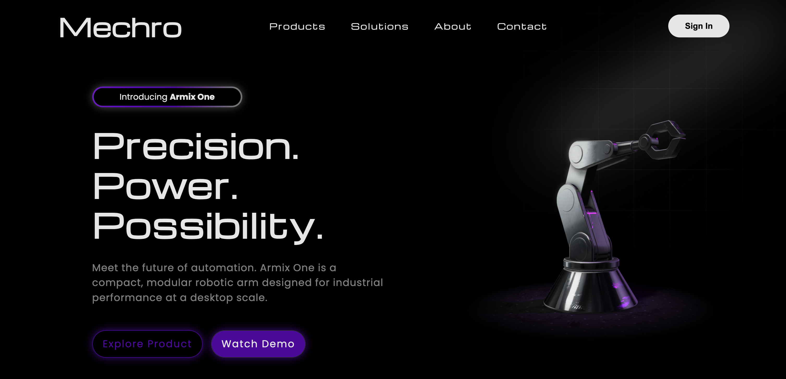

# 🤖 Mechro – Robotics, Refined

**Mechro** is a futuristic landing page for a robotics company showcasing "Armix One", a modular robotic arm. The site is crafted with sleek UI animations, a real-time 3D model viewer, and responsive design built for innovation-driven product storytelling.



---

## 🚀 Live Demo

[mechro.vercel.app](https://mechro.vercel.app/)

---

## 📸 Preview

  
*(Interactive robotic arm model embedded via [Spline](https://spline.design))*

---

## 🛠️ Tech Stack

- **HTML5**  
- **CSS3**  
- **JavaScript (ES6)**  
- **AOS (Animate on Scroll)** – For smooth entry animations  
- **Google Fonts** – *Michroma*, *Poppins*, *Montserrat*  
- **Spline** – 3D model rendering of the robotic arm  
- **Responsive Design** – Mobile and tablet friendly

---

## 🎯 Features

- 🌀 **Interactive 3D model viewer** (via `spline-viewer`)
- ⚡ **Smooth AOS animations** with configurable delays and easings
- 📱 **Fully responsive layout** for all screen sizes
- 🎨 **Gradient effects & futuristic UI**
- 🧠 **Semantic HTML structure** for scalability
- 💾 Lightweight — optimized for performance

---

## 🧪 How to Run

1. **Clone this repo**:
   ```bash
   git clone https://github.com/kush11-m/mechro.git
   cd mechro
2.	Open index.html in your browser.
3.	Make sure you’re online to load AOS and the 3D model from Spline CDN.

## 📦 Dependencies
AOS-	Animate on Scroll
Spline- Viewer	3D Web Model Viewer
Google Fonts-	Typography

## 🌈 Customization Tips
•	Replace the Spline model URL in:
  <spline-viewer url="https://prod.spline.design/Q3r01fo6UMjVqwO9/scene.splinecode"></spline-viewer>
•	Add new navigation pages or integrate with a backend as needed.
•	Swap color schemes in style.css to fit your branding.
•	Host assets (images/models) locally for production environments.

## 📈 Roadmap
•	Add authentication and login page
•	Deploy on GitHub Pages or Netlify
•	Add product carousel and spec sheets
•	Integrate contact form with backend (e.g., Formspree or Node.js)

## 💡 Inspiration
Inspired by modern robotics websites like Boston Dynamics and cyberpunk UI aesthetics.

## 📬 Contact
Made with 💜 by Kushagra Maheshwari
For collaborations or feedback, email me at: kushagramaheshwari584@gmail.com
